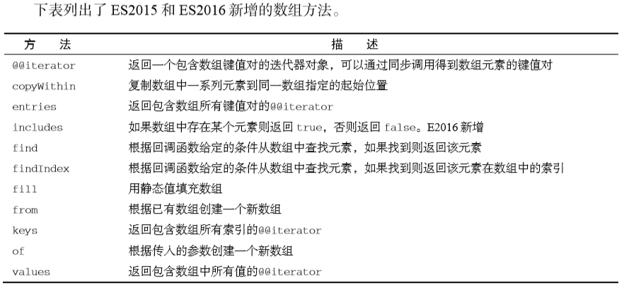

array方法实现

> [array](https://juejin.im/post/5d82c12ff265da03a31d6f92?utm_source=gold_browser_extension#heading-78)





```javascript

array = [10, 20, 30, 40, 50]

// forEach
function forEach(array, callback) {
    const { length } = array
    for (let index = 0; index < length; index++) {
        const element = array[index];
        callback(element, index, array)
    }
}
// forEach(array, (...args) => console.log(args))


// map 
// 返回新数组
function map(array, callback) {
    const result = []
    const { length } = array
    for (let index = 0; index < length; index++) {
        const element = array[index]
        result[index] = callback(element, index, array)
    }
    return result
}
console.log(map(array, element => element + ' map'));


// push
function push(array, ...elements) {
    const { length: arrayLen } = array
    const { length: elementsLen } = elements
    for (let index = 0; index < elementsLen; index++) {
        array[arrayLen + index] = elements[index];
    }
    return array.length
}


// filter
// 返回新数组
function filter(array, callback) {
    const result = []
    const { length } = array
    for (let index = 0; index < length; index++) {
        const element = array[index];
        if (callback(element, index, array)) {
            push(result, element)
        }
    }
    return result
}
console.log(filter(array, element => element % 2 == 0));


// reduce
function reduce(array, callback, initValue) {
    const { length } = array
    let cbTmp = initValue
    let startAtIndex = 0
    if (initValue === undefined) {
        cbTmp = array[0]
        startAtIndex = 1
    }
    for (let index = startAtIndex; index < length; index++) {
        const element = array[index]
        cbTmp = callback(cbTmp, element, index, array)

    }
    return cbTmp;
}
console.log(reduce(array, (sum, element) => sum + element));


// findIndex
function findIndex(array, callback) {
    const { length } = array
    for (let index = 0; index < length; index++) {
        const element = array[index];
        if (callback(element, index, array)) {
            return index
        }
    }
    return -1
}
console.log(findIndex(array, element => element == '20'));


// find 
function find(array, callback) {
    let index = findIndex(array, callback)
    return index === -1 ? undefined : array[index]
}


// indexOf
function indexOf(array, searchValue) {
    return findIndex(array, value => value === searchValue)
}

// lastIndexOf
function lastIndexOf(array, searchValue) {
    const { length } = array
    for (let index = length - 1; index > -1; index--) {
        const element = array[index];
        if (element === searchValue) {
            return index
        }
    }
    return -1
}

// every
function every(array, callback) {
    const { length } = array
    for (let index = 0; index < length; index++) {
        const element = array[index]
        if (!callback(element, index, array)) {
            return false
        }
    }
    return true
}
console.log(every(array, value => value > 20));


// some
function some(array, callback) {
    const { length } = array
    for (let index = 0; index < length; index++) {
        const element = array[index];
        if (callback(element, index, array)) {
            return true
        }
    }
    return false
}

// includes
function includes(array, searchValue) {
    return some(array, value => value === searchValue)
}


// ----------
// concat
function concat(array, ...values) {
    const result = [...array]
    const { length } = values
    for (let index = 0; index < length; index++) {
        const element = array[index]
        if (Array.isArray(element)) {
            push(result, ...element)
        } else {
            push(result, element)
        }
    }
    return result
}


// join
function join(array, joinWith) {
    return reduce(array, (result, current, index) => {
        if (index === 0) {
            return current
        }
        return `${result}${joinWith}${current}`
    }, '')
}


// reverse
function reverse(array) {
    const result = []
    const lastIndex = array.length - 1
    for (let index = lastIndex; index > -1; index--) {
        const element = array[index]
        result[lastIndex - index] = element
    }
    return result
}


// shift
function shift(array) {
    const { length } = array
    const firstVal = array[0]
    for (let index = 1; index < length; index++) {
        array[index - 1] = array[index];
    }
    array.length = length - 1
    return firstVal
}
// console.log(array);
// console.log(shift(array));
// console.log(array);


// unshift
function unshift(array, ...insertVals) {
    const mergedArrays = concat(insertVals, ...array)
    const { length: mergedArraysLength } = mergedArrays
    for (let index = 0; index < mergedArraysLength; index++) {
        array[index] = mergedArrays[index];
    }
    return array.length
}


// slice 浅拷贝
function slice(array, startIndex = 0, endIndex = array.length) {
    const result = []
    // endIndex 可能超出数组长度范围
    endIndex = endIndex > array.length ? array.length : endIndex
    for (let index = startIndex; index < endIndex; index++) {
        const element = array[index];
        push(result, element)
    }
    return result
}


// splice
function splice(array, insertAtIndex, removeNumberOfElements, ...values) {
    const firstPart = slice(array, 0, insertAtIndex)
    const secondPart = slice(array, insertAtIndex + removeNumberOfElements)
    const removeElements = slice(slice, insertAtIndex, insertAtIndex + removeNumberOfElements)
    const joinedParts = concat(firstPart, values, secondPart)
    const { length: joinedPartsLength } = joinedParts
    for (let index = 0; index < joinedPartsLength; index++) {
        array[index] = joinedParts[index];
    }
    array.length = joinedPartsLength
    return removeElements
}


// pop


// push


// fill
function fill(array, value, startIndex, endIndex) {
    for (let index = startIndex; index < endIndex; index++) {
        array[index] = value
    }
    return array
}


// flat 指定深度值来减少嵌套深度
function flat(array, depth = 0) {
    return depth < 1 ? array : reduce(array, (result, current) => concat(result, flat(current, depth - 1)), [])
}


// flatMap (map 与 深度值depth为1的flat 几乎相同)
function flatMap(array, callback) {
    return flat(map(array, callback), 1)
}


// values 返回生成器
function values(array) {
    const { length } = array
    function* createGenerator() {
        for (let index = 0; index < length; index++) {
            const element = array[index]
            yield element
        }
    }
    return createGenerator()
}


// keys
function keys(array) {
    const { length } = array
    function* createGenerator() {
        for (let index = 0; index < length; index++) {
            yield index
        }
    }
    return createGenerator()
}


// entries
function entries(array) {
    const { length } = array
    function* createGenerator() {
        for (let index = 0; index < length; index++) {
            const element = array[index]
            yield [index, element]
        }
    }
    return createGenerator()
}
```

