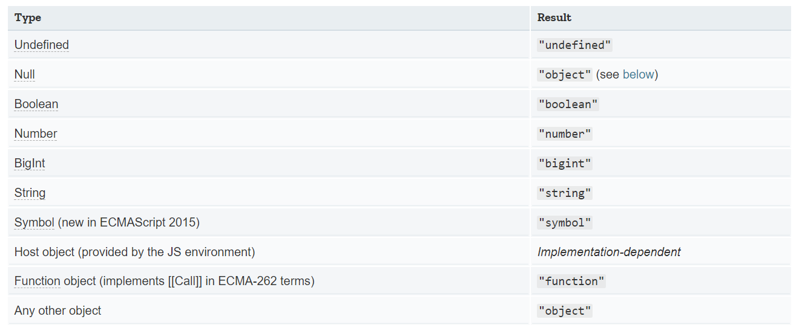

### 1. 判断数据类型的方式

> typeof
>
> instanceof
>
> Object.prototype.toString.call()
>
> constructor

#### 1.1 typeof

> [typeof](https://developer.mozilla.org/en-US/docs/Web/JavaScript/Reference/Operators/typeof)
>
> 除函数外的所有引用类型都是 `object`
>
> `typeof null === 'object'`



#### 1.2 instanceof

> [instanceof](https://developer.mozilla.org/en-US/docs/Web/JavaScript/Reference/Operators/instanceof)
>
> The **instanceof operator** tests whether the `prototype` property of a constructor appears anywhere in the prototype chain of an object.

#### 1.3 toString


#### 1.4 constructor

> [constructor](https://developer.mozilla.org/en-US/docs/Web/JavaScript/Reference/Global_Objects/Object/constructor)

### 2. 深拷贝实现

```javascript
// 写法简单,适用大部分场景
// 缺陷: 拷贝其他引用类型,拷贝函数,循环引用
JSON.parse(JSON.stringify())
```


```javascript
// 浅拷贝
function clone(target){
	let cloneTarget = {}
	for (const key in target){
        cloneTarget[key] = target[key]
    }
    return cloneTarget
}
```


```javascript
// 深拷贝
// 原始类型,直接返回
// 引用类型考虑对象的深度
function clone (target){
    // if (target === null) return target
    if (target !== null && typeof target === 'object'){
        let cloneTarget = {}
        for (const key in target){
            cloneTarget[key] = clone(target[key])
        }
        return cloneTarget
    }else {
        return target
    }
}
```


```javascript
// 以上只考虑了普通的object
// 兼容数组版本
function clone (target){
    if (target && typeof target === 'object'){
        // instanceof 检测数据类型,不是很准确
        // let cloneTarget = target instanceof Array ? [] : {}
        let cloneTarget = target.constructor === Array ? [] : {}
        for (const key in target){
            cloneTarget[key] = clone(target[key])
        }
        return cloneTarget
    }else {
        return target
    }
}
```


```javascript
// 循环引用   target.target = target
// 导致 stack overflow
// 开辟额外的空间存储目标对象与拷贝对象的对应关系
function clone (target, map = new WeakMap()){
    if (target && typeof target === 'object'){
        let cloneTarget = target.constructor === Array ? [] : {}
        if (map.get(target)){
            return map.get(target)
        }
        map.set(target, cloneTarget)
        for (const key in target){
            cloneTarget[key] = clone(target[key], map)
        }
        return cloneTarget
    }else {
        return target
    }
}
```

